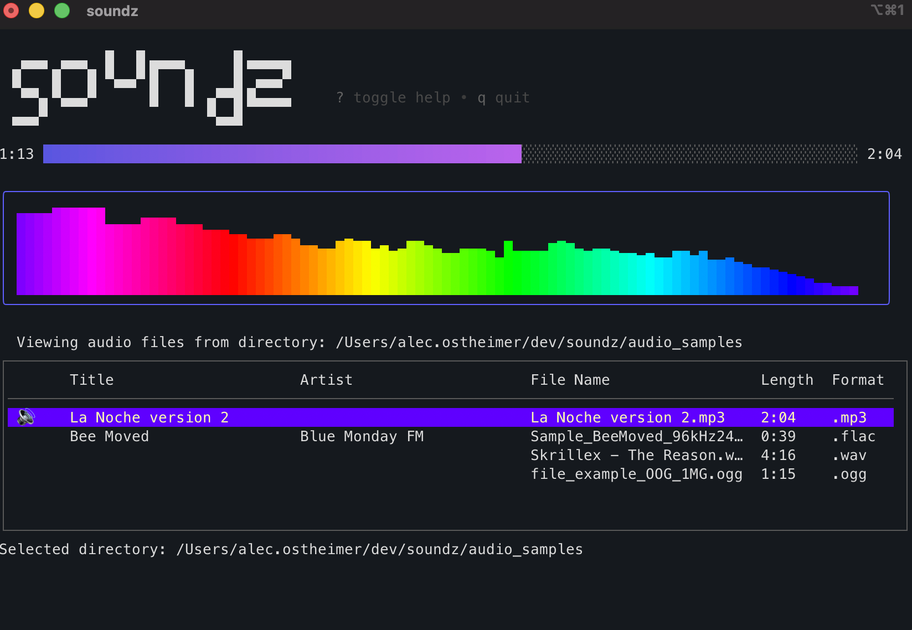

# 🎶 Soundz — Terminal Music Player  

Soundz is a fast, minimal, terminal-based music player built in Go.  
It uses [Bubble Tea](https://github.com/charmbracelet/bubbletea) for the TUI, [Lipgloss](https://github.com/charmbracelet/lipgloss) for styling, and [Beep](https://github.com/gopxl/beep) for audio playback.  

 <!-- optional -->

---

## ✨ Features

- 🎵 **Play local audio files** (MP3, WAV, FLAC, and more)  
- 🎚️ **Real-time progress bar** that updates instantly  
- 📑 **Table view** of your current playlist  
- ⌨️ **Keyboard shortcuts** for play/pause, skip, volume, etc.  
- 🖥️ **Responsive full-screen layout** — title, playlist, and progress bar adjust to your terminal size  
- 🖌️ **Pretty styling** with Lipgloss (centered ASCII art, clean borders)  

---

## 🚀 Installation

### Homebrew (macOS / Linux)

```bash
brew tap Skrillmau5er/soundz
brew install soundz
```

### Go install

```bash
go install github.com/skrillmau5er/soundz@latest
```

### Build from source

Make sure you have [Go 1.22+](https://go.dev/dl/) installed.

```bash
git clone https://github.com/Skrillmau5er/soundz.git
cd soundz
go build -o soundz .